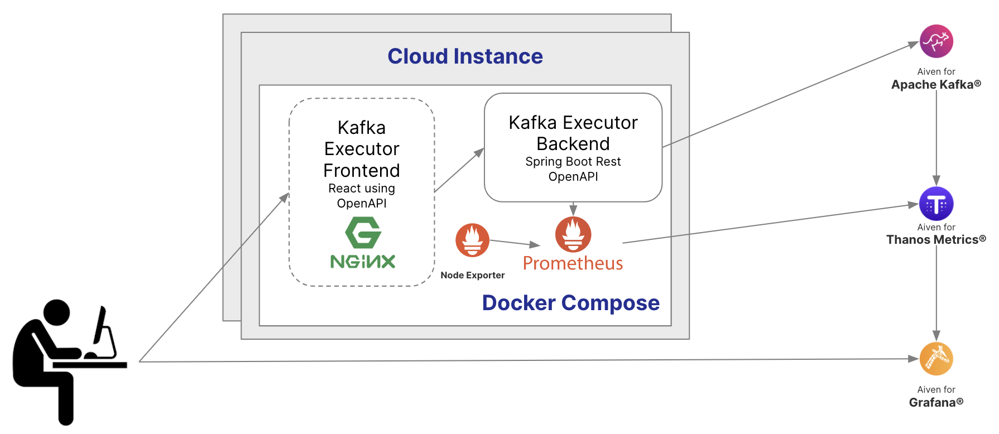

# Kafka Executor
## Description
This customizable load generator will create Kafka workload both with producers and consumers.
Features include controllable parallel execution of different workloads.
There is an easy-to-use Swagger front end that can be used to integrate
with other programming languages such as React, Angular, Python...
JMeter or siege can be used to run and monitor via http calls.

## Architecture

### Terraform
The easiest way to build everything is to use the terraform scripts.  The [documentation](terraform/README.md)    

### Kafka
The star of the show; it's what we are testing to see how it performs with various producers and consumers.

### Thanos 
Store the performance statistics using Thanos so that we can measure the tests.

### Grafana 

displays dashboards to see the Thanos data. The dashboards are automatically pushed to Grafana.  More Information [here](docker-compose/grafana/README.md).

### Cloud instance(s)

The project uses docker compose to create dockers for the following components.

* nginx - The nginx docker provides password protection and serves the [React front-end web pages](websrc/README.md) and proxies the JAVA Web Services. 

* executor - The executor docker is the [JAVA Spring Boot application](src/main/README.md) that executes the  

* node-exporter - The node-exporter captures the machines statistics and sends to prometheus.

* prometheus - The prometheus docker pulls data from node-exporter and from the executor, forwarding the data to Thanos.
