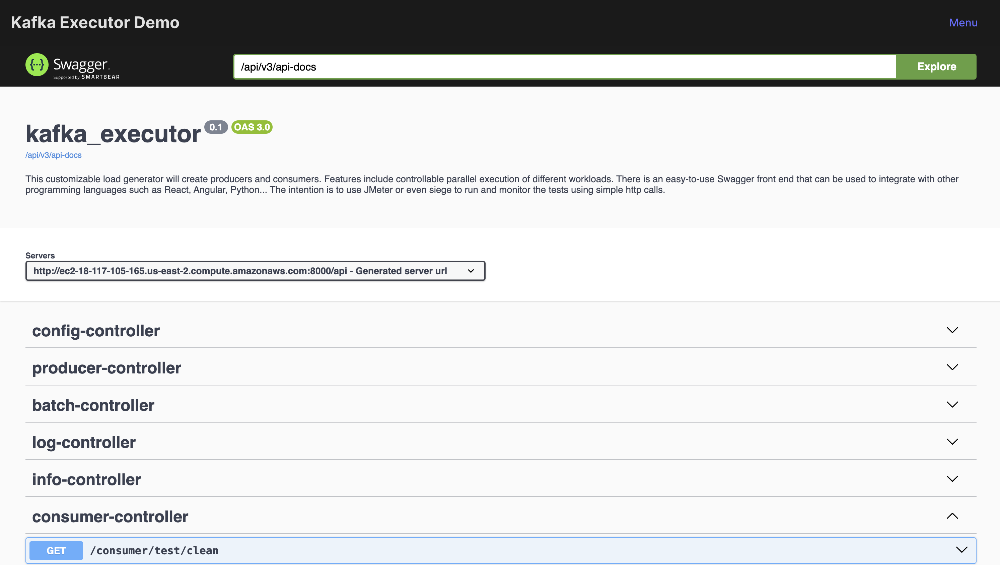
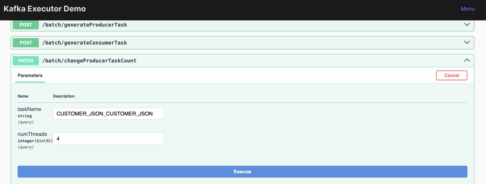

# Kafka Executor JAVA Springboot Application

It uses the prometheus actuator with micrometer to store the performance metrics for Prometheus.

## How to add a new datatype
1. Use the java/aiven/io/kafka_executor/data directory.
2. Create `yourdatatype.java` based on your datatype name. 
3. Use Customer.java or WeatherIOT.java as a template, it must implement the DataInterface class.  Make whatever data you desire.
4. Update DataClass.java and add the values to the ENUM for your new class.

Note: Support for Avro and Protobuf are automatically generated!

## Can run standalone (Convenient for Testing)
* In resources, copy the application.properties.example to application.properties
* Update the application.properties file
* Set up the [certs](../../certs/README.md)
* Use maven to build and execute. ```mvn clean package -DskipTests```

## OpenAPI - Swagger v3




### How to access Swagger
* The GUI interface for Swagger:
  http://127.0.0.1:8080/api/swagger-ui/index.html#/
    * Note: change the ip for above swagger addresses with your server
* The swagger document is here http://127.0.0.1:8080/api/v3/api-docs
    * Note: change the ip for above swagger addresses with your server
* Auto-generating a programmatic interface based upon Swagger: https://github.com/swagger-api/swagger-codegen?tab=readme-ov-file#overview
* An easy client to generate a quick load against the API is siege installable by
    * Source Code: https://github.com/JoeDog/siege/
    * MAC: `brew install siege`
    * Linux: `sudo apt-get install siege`
    * Windows: download https://siege-windows.googlecode.com/svn/trunk/siege-windows-3.0.5.zip then unzip...
* A client with better metrics reporting is JMeter.  See JMeter directory for more details.
### Swagger Documentation also known as OpenAPI
https://swagger.io/docs/specification/about/